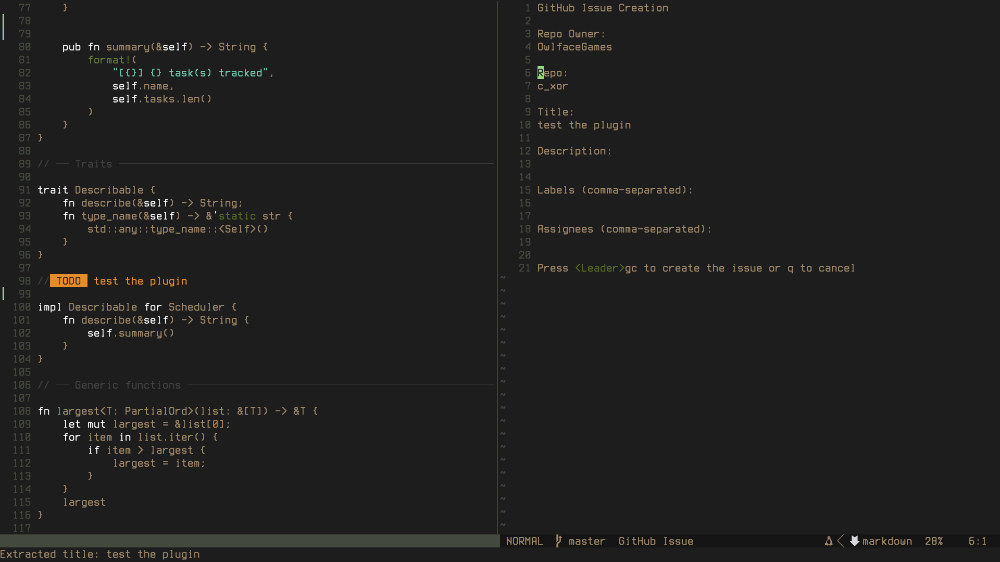

# Issue From Comment

Neovim plugin that creates a github issue from the current comment under your cursor. Then it will add the issue number to the end of the comment.

Repo owner, repo, assignees and labels are sored to a json and read when the plugin is ran again so the plugin will remember the details of the last repo you worked on.

This means you only enter details once then unless you want to change them issue creation is as simple as, write comment, leader gi leader gc.

Json is stored in ".local/share/nvim".




## Requirements

- curl (for GitHub API access)
- A GitHub Personal Access Token with the `repo` scope


## Installation

The usual way you install plugins.

### Lazy Example

```lua
"OwlfaceGames/issue-from-comment.nvim"
```


## Config

Create a file called issue-from-comment in your plugins folder and paste the below settings. Change the keybinds if you like.

```lua
-- In your plugins configuration
return {
        "OwlfaceGames/issue-from-comment.nvim",
        config = function()
                require("issue_from_comment").setup({
                        create_key = '<Leader>gc', -- Custom key to create the issue
                        cancel_key = 'q',          -- Custom key to cancel
                })

                -- Keymapping to open the issue creation buffer
                vim.keymap.set("n", "<Leader>gi", ":GHIssueFromComment<CR>", { noremap = true, silent = true })
        end,
}
```


## Setting Up GitHub Authentication

This plugin requires a GitHub Personal Access Token with the `repo` scope:

1. Go to [GitHub Settings → Developer settings → Personal access tokens → Tokens (classic)](https://github.com/settings/tokens)
2. Click "Generate new token" and select "Generate new token (classic)"
3. Give it a descriptive name like "Neovim issue-from-comment plugin"
4. Select the `repo` scope (or `public_repo` for public repositories only)
5. Click "Generate token" and copy the token

Then, set the token in one of these ways:

### Option 1: Environment Variable (Recommended)

Add this to your shell configuration (`.bashrc`, `.zshrc`, etc.):

```bash
export GITHUB_TOKEN="your-token-here"
```

### Option 2: Direct Configuration

Add the token directly in your Neovim config (less secure):

```lua
require('issue_from_comment').setup({
  github_token = "your-token-here",
})
```


## Support
If you like my work, consider supporting me through [GitHub Sponsors](https://github.com/sponsors/OwlfaceGames)🩷


## License

Distributed under the MIT License. See `LICENSE` for more information.

[](https://opensource.org/licenses/MIT)
